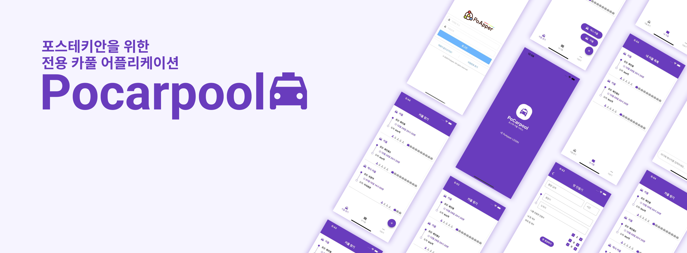

# Pocarpool - POSTECH Carpool Application

<p align="center">
	
</p>

<p align="center">
<a href="https://gitlab.com/hyelie/carpool_backend/-/wikis/home">개발 위키</a> 
| 
<a href="https://gitlab.com/hyelie/carpool_backend/-/issues">이슈</a> 
| 
<a href="https://gitlab.com/hyelie/carpool_backend/-/milestones">마일스톤</a> 
</p>

Pocarpool은 포스텍 구성원들이 접근할 수 있는 카풀 어플리케이션입니다.

포스텍의 위치상 포항역까지 거리가 멀기 때문에 택시나 카풀에 대한 수요가 높습니다. 개인으로 이용할 경우에는 금액이 부담되기 때문에 대부분 포스텍 구성원들이 여러 명의 사람을 모아서 택시를 타는 방법을 택합니다. 

그러나 카풀에 참여할 사람들을 모집하는 곳은 에브리타임, 포비스 라운지 등으로 산재되어 있습니다. 포카풀은 **산재되어 있는 카풀 수요를 하나로 묶어주는 플랫폼**입니다. 

<br>

## 기능
1. 카풀 방 CRUD
 - 사용자가 원하는 카풀 방 검색
 - 카풀 방 참가
 - 카풀 방 탈퇴
 - 카풀 방 생성
 - 카풀 방 정보 수정
2. 실시간 채팅
 - 같은 방에 속해있는 사용자들 간의 실시간 온라인 채팅
3. 신고
 - 어뷰징을 막기 위한 신고

 <br>

## 기술 스택
- [Node.js](https://nodejs.org/ko/) - 비동기 서버용 JavaScript 런타임
- [Express.js](https://expressjs.com/) - Node.js용 웹 애플리케이션 프레임워크
- [Socket.io](https://socket.io/) - WebSocket을 통한 실시간 통신 라이브러리
- [MySQL](https://www.mysql.com/) - 관계형 데이터베이스 관리 시스템

<br>

## 초기 환경 구성(Getting started)
### NVM 설치
다음과 같이 NVM을 설치합니다. NVM 버전은 [공식 github]((https://github.com/nvm-sh/nvm/#install--update-script))에서 버전을 확인할 수 있습니다.

```
# vx.xx.x부분의 버전은 공식 git에서 확인 한 후 변경
curl -o- https://raw.githubusercontent.com/nvm-sh/nvm/vx.xx.x/install.sh | bash

ex) curl -o- https://raw.githubusercontent.com/nvm-sh/nvm/v0.39.1/install.sh | bash

source ~/.bashrc

$ nvm -v
0.38.0
```

### Node 버전 설정
NVM이 설치되어 있다면 아래 명령어를 실행시켜서 Node v16.17.0 (LTS)를 설정합니다.
```
nvm install 16.17.0
nvm use 16.17

$ npm -v
8.15.0
$ node -v
v16.17.0
```

### 프로젝트 설치
```
git clone https://gitlab.com/hyelie/carpool_backend.git
cd code/carpool-backend
npm i                        # node module 설치
node ./bin/www               # 서버 실행
```

<br>

## 팀 정보
백엔드 팀

|이름|역할|Github|Contact|
|:---|----|----|----|
|정혜일|API 및 채팅 구현|<a href="https://github.com/hyelie"></a>|<a href="mailto:hyelie@postech.ac.kr"></a>|
|조은찬|API 및 인증 구현|<a href="https://github.com/Chipmunk-g4"></a>|<a href="mailto:eunchan9029@postech.ac.kr"></a>|